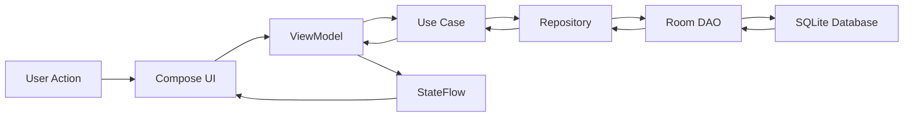
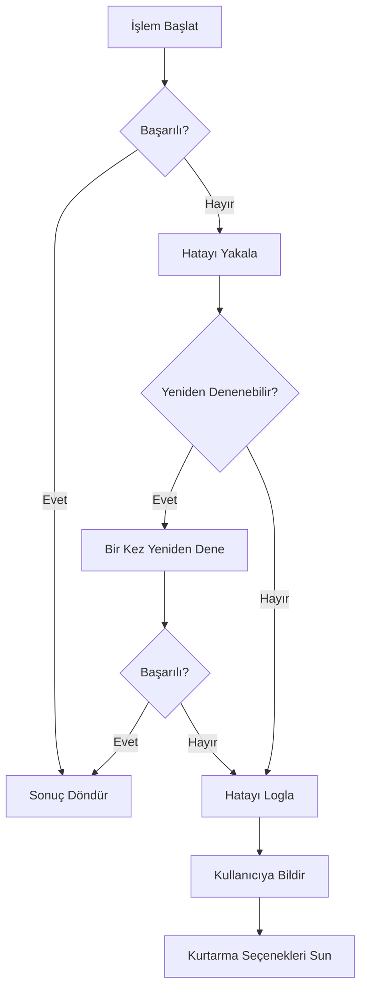

# Tasarım Dokümanı: Notte Android Uygulaması

## Genel Bakış

Notte, macOS'un zamansiz tasarım estetiğini Android platformuna taşıyan minimalist bir not alma uygulamasıdır. Uygulama, Jetpack Compose ve Material Design 3 kullanarak modern Android geliştirme uygulamalarını kasıtlı minimalizm ve akıcı mikro-etkileşimlerle birleştirir.

### Temel Tasarım Prensipleri

1. **Kasıtlı Minimalizm**: Her UI öğesi bir amaca hizmet eder; gereksiz karmaşıklık reddedilir
2. **İçerik Öncelikli**: Tasarım, kullanıcının notlarını öne çıkarır ve dikkat dağıtıcı unsurları ortadan kaldırır
3. **Akıcı Etkileşimler**: Mikro-animasyonlar ve geçişler doğal, insan benzeri bir deneyim yaratır
4. **Performans Odaklı**: Mimari, hız ve verimlilik için optimize edilmiştir
5. **Erişilebilirlik İlk Sırada**: Tüm kullanıcılar için kapsayıcı tasarım

### Teknoloji Yığını

- **UI Framework**: Jetpack Compose (Material Design 3)
- **Programlama Dili**: Kotlin
- **Mimari Deseni**: MVVM (Model-View-ViewModel) + Clean Architecture
- **Veri Kalıcılığı**: Room Database
- **Asenkron İşlemler**: Kotlin Coroutines + Flow
- **Bağımlılık Enjeksiyonu**: Hilt
- **Navigasyon**: Jetpack Navigation Compose

## Mimari

### Katmanlı Mimari

Uygulama, Clean Architecture prensiplerine göre üç ana katmana ayrılmıştır:

```
┌─────────────────────────────────────────┐
│         Presentation Layer              │
│  (UI, ViewModels, Compose Screens)      │
└─────────────────┬───────────────────────┘
                  │
┌─────────────────▼───────────────────────┐
│          Domain Layer                   │
│  (Use Cases, Business Logic, Entities)  │
└─────────────────┬───────────────────────┘
                  │
┌─────────────────▼───────────────────────┐
│           Data Layer                    │
│  (Repository, Room DAO, Data Sources)   │
└─────────────────────────────────────────┘
```


### Katman Sorumlulukları

#### Presentation Layer (Sunum Katmanı)

- **Compose UI Bileşenleri**: Kullanıcı arayüzünü oluşturur
- **ViewModels**: UI durumunu yönetir ve kullanıcı eylemlerini işler
- **Navigation**: Ekranlar arası geçişleri koordine eder
- **Theme System**: Renk paleti ve stil sistemini uygular

#### Domain Layer (Alan Katmanı)

- **Use Cases**: İş mantığını kapsüller (CreateNote, UpdateNote, DeleteNote, vb.)
- **Entities**: Temel iş nesnelerini tanımlar (Note)
- **Repository Interfaces**: Veri erişim sözleşmelerini tanımlar

#### Data Layer (Veri Katmanı)

- **Repository Implementations**: Veri kaynaklarını koordine eder
- **Room Database**: Yerel veri kalıcılığını sağlar
- **DAO (Data Access Objects)**: Veritabanı işlemlerini tanımlar
- **Data Models**: Veritabanı varlıklarını temsil eder

### Veri Akışı



### Bağımlılık Yönetimi

Hilt kullanarak bağımlılık enjeksiyonu:

- **@HiltAndroidApp**: Application sınıfı
- **@AndroidEntryPoint**: Activity ve Fragment'ler
- **@HiltViewModel**: ViewModel'ler
- **@Module**: Bağımlılık sağlayıcıları
- **@Singleton**: Uygulama genelinde tek örnekler (Repository, Database)


## Bileşenler ve Arayüzler

### 1. Note Entity (Domain Layer)

Temel not varlığı:

```kotlin
data class Note(
    val id: String,
    val content: String,
    val createdAt: Long,
    val updatedAt: Long
) {
    fun isValid(): Boolean = content.isNotBlank()
    
    fun getTitle(): String {
        val firstLine = content.lines().firstOrNull() ?: ""
        return firstLine.ifEmpty { content.take(60) }
    }
    
    fun getPreview(): String {
        val lines = content.lines()
        return if (lines.size > 1) {
            lines[1].take(60)
        } else {
            content.take(60)
        }
    }
}
```

### 2. NoteRepository Interface (Domain Layer)

```kotlin
interface NoteRepository {
    fun getAllNotes(): Flow<List<Note>>
    fun getNoteById(id: String): Flow<Note?>
    suspend fun insertNote(note: Note)
    suspend fun updateNote(note: Note)
    suspend fun deleteNote(note: Note)
    fun searchNotes(query: String): Flow<List<Note>>
}
```

### 3. Use Cases (Domain Layer)

Her iş işlemi için ayrı use case:

```kotlin
class CreateNoteUseCase @Inject constructor(
    private val repository: NoteRepository
) {
    suspend operator fun invoke(content: String): Result<Note> {
        if (content.isBlank()) {
            return Result.failure(InvalidNoteException("Content cannot be empty"))
        }
        val note = Note(
            id = UUID.randomUUID().toString(),
            content = content,
            createdAt = System.currentTimeMillis(),
            updatedAt = System.currentTimeMillis()
        )
        return try {
            repository.insertNote(note)
            Result.success(note)
        } catch (e: Exception) {
            Result.failure(e)
        }
    }
}

class UpdateNoteUseCase @Inject constructor(
    private val repository: NoteRepository
) {
    suspend operator fun invoke(note: Note): Result<Unit> {
        if (!note.isValid()) {
            return Result.failure(InvalidNoteException("Note content is invalid"))
        }
        return try {
            val updatedNote = note.copy(updatedAt = System.currentTimeMillis())
            repository.updateNote(updatedNote)
            Result.success(Unit)
        } catch (e: Exception) {
            Result.failure(e)
        }
    }
}

class DeleteNoteUseCase @Inject constructor(
    private val repository: NoteRepository
) {
    suspend operator fun invoke(note: Note): Result<Unit> {
        return try {
            repository.deleteNote(note)
            Result.success(Unit)
        } catch (e: Exception) {
            Result.failure(e)
        }
    }
}

class GetAllNotesUseCase @Inject constructor(
    private val repository: NoteRepository
) {
    operator fun invoke(): Flow<List<Note>> {
        return repository.getAllNotes()
            .map { notes -> notes.sortedByDescending { it.updatedAt } }
    }
}

class SearchNotesUseCase @Inject constructor(
    private val repository: NoteRepository
) {
    operator fun invoke(query: String): Flow<List<Note>> {
        return repository.searchNotes(query)
            .map { notes -> notes.sortedByDescending { it.updatedAt } }
    }
}
```


### 4. ViewModels (Presentation Layer)

#### NoteListViewModel

```kotlin
@HiltViewModel
class NoteListViewModel @Inject constructor(
    private val getAllNotesUseCase: GetAllNotesUseCase,
    private val deleteNoteUseCase: DeleteNoteUseCase,
    private val searchNotesUseCase: SearchNotesUseCase
) : ViewModel() {
    
    private val _uiState = MutableStateFlow<NoteListUiState>(NoteListUiState.Loading)
    val uiState: StateFlow<NoteListUiState> = _uiState.asStateFlow()
    
    private val _searchQuery = MutableStateFlow("")
    val searchQuery: StateFlow<String> = _searchQuery.asStateFlow()
    
    init {
        observeNotes()
    }
    
    private fun observeNotes() {
        viewModelScope.launch {
            searchQuery.flatMapLatest { query ->
                if (query.isEmpty()) {
                    getAllNotesUseCase()
                } else {
                    searchNotesUseCase(query)
                }
            }.collect { notes ->
                _uiState.value = if (notes.isEmpty()) {
                    NoteListUiState.Empty
                } else {
                    NoteListUiState.Success(notes)
                }
            }
        }
    }
    
    fun onSearchQueryChanged(query: String) {
        _searchQuery.value = query
    }
    
    fun deleteNote(note: Note) {
        viewModelScope.launch {
            deleteNoteUseCase(note).onFailure { error ->
                _uiState.value = NoteListUiState.Error(error.message ?: "Delete failed")
            }
        }
    }
}

sealed class NoteListUiState {
    object Loading : NoteListUiState()
    object Empty : NoteListUiState()
    data class Success(val notes: List<Note>) : NoteListUiState()
    data class Error(val message: String) : NoteListUiState()
}
```

#### NoteEditorViewModel

```kotlin
@HiltViewModel
class NoteEditorViewModel @Inject constructor(
    private val createNoteUseCase: CreateNoteUseCase,
    private val updateNoteUseCase: UpdateNoteUseCase,
    private val repository: NoteRepository,
    savedStateHandle: SavedStateHandle
) : ViewModel() {
    
    private val noteId: String? = savedStateHandle["noteId"]
    
    private val _uiState = MutableStateFlow<NoteEditorUiState>(NoteEditorUiState.Loading)
    val uiState: StateFlow<NoteEditorUiState> = _uiState.asStateFlow()
    
    private val _content = MutableStateFlow("")
    val content: StateFlow<String> = _content.asStateFlow()
    
    private var currentNote: Note? = null
    private var autoSaveJob: Job? = null
    
    init {
        loadNote()
        setupAutoSave()
    }
    
    private fun loadNote() {
        viewModelScope.launch {
            if (noteId != null) {
                repository.getNoteById(noteId).collect { note ->
                    if (note != null) {
                        currentNote = note
                        _content.value = note.content
                        _uiState.value = NoteEditorUiState.Editing(note)
                    }
                }
            } else {
                _uiState.value = NoteEditorUiState.Creating
            }
        }
    }
    
    private fun setupAutoSave() {
        viewModelScope.launch {
            content
                .debounce(2000) // 2 saniye bekle
                .collect { content ->
                    if (content.isNotBlank()) {
                        saveNote(content)
                    }
                }
        }
    }
    
    fun onContentChanged(newContent: String) {
        _content.value = newContent
    }
    
    private suspend fun saveNote(content: String) {
        if (currentNote != null) {
            updateNoteUseCase(currentNote!!.copy(content = content))
        } else if (content.isNotBlank()) {
            createNoteUseCase(content).onSuccess { note ->
                currentNote = note
            }
        }
    }
    
    fun onBackPressed() {
        viewModelScope.launch {
            val content = _content.value
            if (content.isNotBlank()) {
                saveNote(content)
            }
        }
    }
}

sealed class NoteEditorUiState {
    object Loading : NoteEditorUiState()
    object Creating : NoteEditorUiState()
    data class Editing(val note: Note) : NoteEditorUiState()
    data class Error(val message: String) : NoteEditorUiState()
}
```


### 5. Compose UI Bileşenleri

#### NoteListScreen

```kotlin
@Composable
fun NoteListScreen(
    viewModel: NoteListViewModel = hiltViewModel(),
    onNoteClick: (String) -> Unit,
    onCreateClick: () -> Unit
) {
    val uiState by viewModel.uiState.collectAsState()
    val searchQuery by viewModel.searchQuery.collectAsState()
    
    Scaffold(
        topBar = {
            NoteListTopBar(
                searchQuery = searchQuery,
                onSearchQueryChanged = viewModel::onSearchQueryChanged
            )
        },
        floatingActionButton = {
            FloatingActionButton(
                onClick = onCreateClick,
                containerColor = NotteTheme.colors.primary
            ) {
                Icon(Icons.Default.Add, contentDescription = "Create note")
            }
        }
    ) { padding ->
        when (uiState) {
            is NoteListUiState.Loading -> LoadingIndicator()
            is NoteListUiState.Empty -> EmptyState(onCreateClick)
            is NoteListUiState.Success -> {
                NoteList(
                    notes = (uiState as NoteListUiState.Success).notes,
                    onNoteClick = onNoteClick,
                    onNoteLongPress = { note -> viewModel.deleteNote(note) },
                    modifier = Modifier.padding(padding)
                )
            }
            is NoteListUiState.Error -> ErrorState((uiState as NoteListUiState.Error).message)
        }
    }
}

@Composable
fun NoteList(
    notes: List<Note>,
    onNoteClick: (String) -> Unit,
    onNoteLongPress: (Note) -> Unit,
    modifier: Modifier = Modifier
) {
    val configuration = LocalConfiguration.current
    val columns = if (configuration.screenWidthDp >= 600) 2 else 1
    
    LazyVerticalGrid(
        columns = GridCells.Fixed(columns),
        contentPadding = PaddingValues(16.dp),
        horizontalArrangement = Arrangement.spacedBy(16.dp),
        verticalArrangement = Arrangement.spacedBy(16.dp),
        modifier = modifier
    ) {
        items(notes, key = { it.id }) { note ->
            NoteCard(
                note = note,
                onClick = { onNoteClick(note.id) },
                onLongPress = { onNoteLongPress(note) },
                modifier = Modifier.animateItemPlacement()
            )
        }
    }
}

@Composable
fun NoteCard(
    note: Note,
    onClick: () -> Unit,
    onLongPress: () -> Unit,
    modifier: Modifier = Modifier
) {
    var showDeleteDialog by remember { mutableStateOf(false) }
    
    Card(
        modifier = modifier
            .fillMaxWidth()
            .combinedClickable(
                onClick = onClick,
                onLongClick = { showDeleteDialog = true }
            ),
        shape = RoundedCornerShape(12.dp),
        colors = CardDefaults.cardColors(
            containerColor = NotteTheme.colors.surface
        )
    ) {
        Column(
            modifier = Modifier.padding(16.dp)
        ) {
            Text(
                text = note.getTitle(),
                style = MaterialTheme.typography.titleMedium,
                maxLines = 1,
                overflow = TextOverflow.Ellipsis
            )
            Spacer(modifier = Modifier.height(8.dp))
            Text(
                text = note.getPreview(),
                style = MaterialTheme.typography.bodyMedium,
                color = MaterialTheme.colorScheme.onSurfaceVariant,
                maxLines = 2,
                overflow = TextOverflow.Ellipsis
            )
            Spacer(modifier = Modifier.height(12.dp))
            Text(
                text = formatTimestamp(note.updatedAt),
                style = MaterialTheme.typography.labelSmall,
                color = MaterialTheme.colorScheme.onSurfaceVariant
            )
        }
    }
    
    if (showDeleteDialog) {
        DeleteConfirmationDialog(
            onConfirm = {
                onLongPress()
                showDeleteDialog = false
            },
            onDismiss = { showDeleteDialog = false }
        )
    }
}
```


#### NoteEditorScreen

```kotlin
@Composable
fun NoteEditorScreen(
    viewModel: NoteEditorViewModel = hiltViewModel(),
    onBackPressed: () -> Unit
) {
    val uiState by viewModel.uiState.collectAsState()
    val content by viewModel.content.collectAsState()
    val focusRequester = remember { FocusRequester() }
    
    LaunchedEffect(Unit) {
        focusRequester.requestFocus()
    }
    
    BackHandler {
        viewModel.onBackPressed()
        onBackPressed()
    }
    
    Scaffold(
        topBar = {
            NoteEditorTopBar(onBackPressed = {
                viewModel.onBackPressed()
                onBackPressed()
            })
        }
    ) { padding ->
        Box(
            modifier = Modifier
                .fillMaxSize()
                .padding(padding)
        ) {
            BasicTextField(
                value = content,
                onValueChange = viewModel::onContentChanged,
                modifier = Modifier
                    .fillMaxSize()
                    .padding(16.dp)
                    .focusRequester(focusRequester),
                textStyle = MaterialTheme.typography.bodyLarge.copy(
                    color = MaterialTheme.colorScheme.onSurface
                ),
                decorationBox = { innerTextField ->
                    if (content.isEmpty()) {
                        Text(
                            text = "Notunuzu buraya yazın...",
                            style = MaterialTheme.typography.bodyLarge,
                            color = MaterialTheme.colorScheme.onSurfaceVariant
                        )
                    }
                    innerTextField()
                }
            )
        }
    }
}
```

### 6. Navigation

```kotlin
@Composable
fun NotteNavigation() {
    val navController = rememberNavController()
    
    NavHost(
        navController = navController,
        startDestination = "note_list",
        enterTransition = {
            slideInHorizontally(
                initialOffsetX = { it },
                animationSpec = tween(250, easing = FastOutSlowInEasing)
            )
        },
        exitTransition = {
            slideOutHorizontally(
                targetOffsetX = { -it },
                animationSpec = tween(250, easing = FastOutSlowInEasing)
            )
        },
        popEnterTransition = {
            slideInHorizontally(
                initialOffsetX = { -it },
                animationSpec = tween(250, easing = FastOutSlowInEasing)
            )
        },
        popExitTransition = {
            slideOutHorizontally(
                targetOffsetX = { it },
                animationSpec = tween(250, easing = FastOutSlowInEasing)
            )
        }
    ) {
        composable("note_list") {
            NoteListScreen(
                onNoteClick = { noteId ->
                    navController.navigate("note_editor/$noteId")
                },
                onCreateClick = {
                    navController.navigate("note_editor/new")
                }
            )
        }
        
        composable(
            route = "note_editor/{noteId}",
            arguments = listOf(navArgument("noteId") { type = NavType.StringType })
        ) {
            NoteEditorScreen(
                onBackPressed = { navController.popBackStack() }
            )
        }
    }
}
```


## Veri Modelleri

### Room Database Şeması

#### NoteEntity (Data Layer)

```kotlin
@Entity(tableName = "notes")
data class NoteEntity(
    @PrimaryKey
    val id: String,
    @ColumnInfo(name = "content")
    val content: String,
    @ColumnInfo(name = "created_at")
    val createdAt: Long,
    @ColumnInfo(name = "updated_at")
    val updatedAt: Long
)
```

#### NoteDao

```kotlin
@Dao
interface NoteDao {
    @Query("SELECT * FROM notes ORDER BY updated_at DESC")
    fun getAllNotes(): Flow<List<NoteEntity>>
    
    @Query("SELECT * FROM notes WHERE id = :id")
    fun getNoteById(id: String): Flow<NoteEntity?>
    
    @Insert(onConflict = OnConflictStrategy.REPLACE)
    suspend fun insertNote(note: NoteEntity)
    
    @Update
    suspend fun updateNote(note: NoteEntity)
    
    @Delete
    suspend fun deleteNote(note: NoteEntity)
    
    @Query("SELECT * FROM notes WHERE content LIKE '%' || :query || '%' ORDER BY updated_at DESC")
    fun searchNotes(query: String): Flow<List<NoteEntity>>
}
```


#### NotteDatabase

```kotlin
@Database(entities = [NoteEntity::class], version = 1, exportSchema = false)
abstract class NotteDatabase : RoomDatabase() {
    abstract fun noteDao(): NoteDao
}
```

#### NoteMapper

Domain ve Data katmanları arasında dönüşüm:

```kotlin
fun NoteEntity.toDomain(): Note {
    return Note(
        id = id,
        content = content,
        createdAt = createdAt,
        updatedAt = updatedAt
    )
}

fun Note.toEntity(): NoteEntity {
    return NoteEntity(
        id = id,
        content = content,
        createdAt = createdAt,
        updatedAt = updatedAt
    )
}
```

#### NoteRepositoryImpl

```kotlin
class NoteRepositoryImpl @Inject constructor(
    private val noteDao: NoteDao
) : NoteRepository {
    
    override fun getAllNotes(): Flow<List<Note>> {
        return noteDao.getAllNotes().map { entities ->
            entities.map { it.toDomain() }
        }
    }
    
    override fun getNoteById(id: String): Flow<Note?> {
        return noteDao.getNoteById(id).map { it?.toDomain() }
    }
    
    override suspend fun insertNote(note: Note) {
        noteDao.insertNote(note.toEntity())
    }
    
    override suspend fun updateNote(note: Note) {
        noteDao.updateNote(note.toEntity())
    }
    
    override suspend fun deleteNote(note: Note) {
        noteDao.deleteNote(note.toEntity())
    }
    
    override fun searchNotes(query: String): Flow<List<Note>> {
        return noteDao.searchNotes(query).map { entities ->
            entities.map { it.toDomain() }
        }
    }
}
```


### Theme System (macOS-Inspired Design)

#### Renk Paleti

```kotlin
object NotteColors {
    // Birincil renkler (macOS yeşil tonları)
    val Primary = Color(0xFF84B179)      // #84B179
    val Secondary = Color(0xFFA2CB8B)    // #A2CB8B
    val Tertiary = Color(0xFFC7EABB)     // #C7EABB
    val Background = Color(0xFFE8F5BD)   // #E8F5BD
    
    // Açık mod
    val LightSurface = Color(0xFFFFFBF5)
    val LightOnSurface = Color(0xFF1C1B1F)
    val LightOnSurfaceVariant = Color(0xFF49454F)
    
    // Koyu mod
    val DarkSurface = Color(0xFF1C1B1F)
    val DarkOnSurface = Color(0xFFE6E1E5)
    val DarkOnSurfaceVariant = Color(0xFFCAC4D0)
    
    // Koyu mod için uyarlanmış yeşil tonları
    val DarkPrimary = Color(0xFF9BC98E)
    val DarkSecondary = Color(0xFFB5D9A3)
    val DarkTertiary = Color(0xFFD4F0C8)
}

@Composable
fun NotteTheme(
    darkTheme: Boolean = isSystemInDarkTheme(),
    content: @Composable () -> Unit
) {
    val colorScheme = if (darkTheme) {
        darkColorScheme(
            primary = NotteColors.DarkPrimary,
            secondary = NotteColors.DarkSecondary,
            tertiary = NotteColors.DarkTertiary,
            surface = NotteColors.DarkSurface,
            onSurface = NotteColors.DarkOnSurface,
            onSurfaceVariant = NotteColors.DarkOnSurfaceVariant
        )
    } else {
        lightColorScheme(
            primary = NotteColors.Primary,
            secondary = NotteColors.Secondary,
            tertiary = NotteColors.Tertiary,
            surface = NotteColors.LightSurface,
            background = NotteColors.Background,
            onSurface = NotteColors.LightOnSurface,
            onSurfaceVariant = NotteColors.LightOnSurfaceVariant
        )
    }
    
    MaterialTheme(
        colorScheme = colorScheme,
        typography = NotteTypography,
        shapes = NotteShapes,
        content = content
    )
}
```


#### Tipografi

```kotlin
val NotteTypography = Typography(
    displayLarge = TextStyle(
        fontFamily = FontFamily.Default,
        fontWeight = FontWeight.Normal,
        fontSize = 57.sp,
        lineHeight = 64.sp,
        letterSpacing = (-0.25).sp
    ),
    titleLarge = TextStyle(
        fontFamily = FontFamily.Default,
        fontWeight = FontWeight.SemiBold,
        fontSize = 22.sp,
        lineHeight = 28.sp,
        letterSpacing = 0.sp
    ),
    titleMedium = TextStyle(
        fontFamily = FontFamily.Default,
        fontWeight = FontWeight.Medium,
        fontSize = 16.sp,
        lineHeight = 24.sp,
        letterSpacing = 0.15.sp
    ),
    bodyLarge = TextStyle(
        fontFamily = FontFamily.Default,
        fontWeight = FontWeight.Normal,
        fontSize = 16.sp,
        lineHeight = 24.sp,
        letterSpacing = 0.5.sp
    ),
    bodyMedium = TextStyle(
        fontFamily = FontFamily.Default,
        fontWeight = FontWeight.Normal,
        fontSize = 14.sp,
        lineHeight = 20.sp,
        letterSpacing = 0.25.sp
    ),
    labelSmall = TextStyle(
        fontFamily = FontFamily.Default,
        fontWeight = FontWeight.Medium,
        fontSize = 11.sp,
        lineHeight = 16.sp,
        letterSpacing = 0.5.sp
    )
)
```

#### Şekiller

```kotlin
val NotteShapes = Shapes(
    small = RoundedCornerShape(8.dp),
    medium = RoundedCornerShape(12.dp),
    large = RoundedCornerShape(16.dp)
)
```


### Animasyon Sistemi

#### Geçiş Animasyonları

```kotlin
object NotteAnimations {
    // Navigasyon geçişleri
    val navigationEnterTransition = slideInHorizontally(
        initialOffsetX = { it },
        animationSpec = tween(
            durationMillis = 250,
            easing = FastOutSlowInEasing
        )
    ) + fadeIn(animationSpec = tween(250))
    
    val navigationExitTransition = slideOutHorizontally(
        targetOffsetX = { -it / 3 },
        animationSpec = tween(
            durationMillis = 250,
            easing = FastOutSlowInEasing
        )
    ) + fadeOut(animationSpec = tween(250))
    
    // Liste öğesi animasyonları
    val itemEnterAnimation = fadeIn(
        animationSpec = tween(
            durationMillis = 150,
            easing = LinearOutSlowInEasing
        )
    ) + expandVertically(
        animationSpec = tween(
            durationMillis = 150,
            easing = LinearOutSlowInEasing
        )
    )
    
    val itemExitAnimation = fadeOut(
        animationSpec = tween(
            durationMillis = 300,
            easing = FastOutLinearInEasing
        )
    ) + shrinkVertically(
        animationSpec = tween(
            durationMillis = 300,
            easing = FastOutLinearInEasing
        )
    )
}
```

#### Dokunsal Geri Bildirim

```kotlin
@Composable
fun Modifier.notteClickable(
    onClick: () -> Unit,
    hapticFeedback: Boolean = true
): Modifier {
    val haptic = LocalHapticFeedback.current
    
    return this.clickable {
        if (hapticFeedback) {
            haptic.performHapticFeedback(HapticFeedbackType.LongPress)
        }
        onClick()
    }
}
```


## Doğruluk Özellikleri

*Bir özellik (property), bir sistemin tüm geçerli yürütmelerinde doğru olması gereken bir karakteristik veya davranıştır - esasen, sistemin ne yapması gerektiği hakkında resmi bir ifadedir. Özellikler, insan tarafından okunabilir spesifikasyonlar ile makine tarafından doğrulanabilir doğruluk garantileri arasında köprü görevi görür.*

### Özellik Yansıması

Prework analizinden sonra, aşağıdaki özellikler birleştirilebilir veya gereksizdir:
- 1.4, 2.3, 7.3: Hepsi otomatik kaydetme mekanizmasını test ediyor → Tek özellikte birleştir
- 9.5 ve 11.5: Her ikisi de minimum dokunma hedefi boyutunu test ediyor → Birleştir
- 9.6 ve 11.4: Her ikisi de dinamik font boyutlandırmayı test ediyor → Birleştir
- 7.4 ve 12.1: Her ikisi de depolama hatası mesajlarını test ediyor → Birleştir

### Özellik 1: Geçerli Not Kalıcılığı

*Herhangi bir* boş olmayan içeriğe sahip not için, geri gidildiğinde not veritabanına kaydedilmeli ve sonraki uygulama başlatmalarında geri yüklenmelidir.

**Doğrular: Gereksinimler 1.5, 7.5**

### Özellik 2: Boş Not Reddi

*Herhangi bir* sadece boşluk karakterlerinden oluşan içerik için, not oluşturma veya güncelleme işlemi reddedilmeli ve veritabanına kaydedilmemelidir.

**Doğrular: Gereksinimler 1.6**

### Özellik 3: Otomatik Kaydetme Mekanizması

*Herhangi bir* not düzenleme oturumu için, içerik değişikliğinden sonra 2 saniye içinde otomatik kaydetme tetiklenmelidir.

**Doğrular: Gereksinimler 1.4, 2.3, 7.3**


### Özellik 4: Not Yükleme Bütünlüğü

*Herhangi bir* kaydedilmiş not için, listeden seçildiğinde editör tam not içeriğini doğru şekilde yüklemelidir.

**Doğrular: Gereksinimler 2.1, 2.2**

### Özellik 5: Zaman Damgası Güncelleme

*Herhangi bir* not için, içerik değiştirildiğinde updatedAt zaman damgası güncellenmelidir.

**Doğrular: Gereksinimler 2.4**

### Özellik 6: Durum Geri Yükleme

*Herhangi bir* kaydırma konumu için, uygulama kesintiden sonra düzenlemeye döndüğünde aynı konum geri yüklenmelidir.

**Doğrular: Gereksinimler 2.5**

### Özellik 7: Ters Kronolojik Sıralama

*Herhangi bir* not listesi için, notlar updatedAt zaman damgasına göre azalan sırada (en yeni ilk) görüntülenmelidir.

**Doğrular: Gereksinimler 3.1**

### Özellik 8: Not Önizleme Formatı

*Herhangi bir* not için, önizleme ilk satırı başlık ve ikinci satırı (veya tek satır ise ilk 60 karakter) içerik olarak göstermelidir.

**Doğrular: Gereksinimler 3.2, 3.3**

### Özellik 9: Zaman Damgası Görünürlüğü

*Herhangi bir* not kartı için, son değiştirilme zaman damgası görüntülenmelidir.

**Doğrular: Gereksinimler 3.4**

### Özellik 10: Silme İşlemi Bütünlüğü

*Herhangi bir* not için, silme onaylandığında not veritabanından kaldırılmalı ve listeden kaybolmalıdır.

**Doğrular: Gereksinimler 4.2**


### Özellik 11: Silme Hatası Kurtarma

*Herhangi bir* silme işlemi başarısız olduğunda, hata mesajı görüntülenmeli ve not listede geri yüklenmelidir.

**Doğrular: Gereksinimler 4.5**

### Özellik 12: Dokunsal Geri Bildirim

*Herhangi bir* etkileşimli öğe için, dokunulduğunda haptic feedback tetiklenmelidir.

**Doğrular: Gereksinimler 6.2**

### Özellik 13: Depolama Hatası İşleme

*Herhangi bir* depolama işlemi başarısız olduğunda, kullanıcı dostu hata mesajı görüntülenmeli ve bir kez yeniden denenmelidir.

**Doğrular: Gereksinimler 7.4, 12.1**

### Özellik 14: Eşzamanlılık Güvenliği

*Herhangi bir* eşzamanlı okuma/yazma işlem seti için, veri tutarlılığı korunmalı ve yarış durumları önlenmelidir.

**Doğrular: Gereksinimler 7.6**

### Özellik 15: Arama Filtreleme

*Herhangi bir* arama sorgusu için, döndürülen tüm notlar sorgu metnini başlıkta veya içerikte içermelidir.

**Doğrular: Gereksinimler 8.2, 8.3**

### Özellik 16: Arama Vurgulama

*Herhangi bir* arama sonucu için, eşleşen metin görsel olarak vurgulanmalıdır.

**Doğrular: Gereksinimler 8.4**

### Özellik 17: Arama Temizleme

*Herhangi bir* aktif arama için, sorgu temizlendiğinde tam not listesi geri yüklenmelidir.

**Doğrular: Gereksinimler 8.6**


### Özellik 18: Responsive Düzen Uyarlaması

*Herhangi bir* 320dp ile 900dp arasındaki ekran genişliği için, düzen uygun şekilde uyarlanmalı ve tüm içerik erişilebilir olmalıdır.

**Doğrular: Gereksinimler 9.1, 9.4**

### Özellik 19: Minimum Dokunma Hedefi

*Herhangi bir* etkileşimli öğe için, minimum 48dp dokunma hedefi boyutu korunmalıdır.

**Doğrular: Gereksinimler 9.5, 11.5**

### Özellik 20: Dinamik Font Boyutlandırma

*Herhangi bir* sistem font boyutu ayarı için, uygulama UI'si orantılı olarak uyarlanmalıdır.

**Doğrular: Gereksinimler 9.6, 11.4**

### Özellik 21: İçerik Açıklamaları

*Herhangi bir* etkileşimli öğe için, anlamlı içerik açıklaması (content description) sağlanmalıdır.

**Doğrular: Gereksinimler 11.1**

### Özellik 22: Odak Sırası

*Herhangi bir* ekran için, TalkBack odak sırası mantıksal okuma sırasını takip etmelidir.

**Doğrular: Gereksinimler 11.2**

### Özellik 23: Kontrast Oranları

*Herhangi bir* metin öğesi için, arka planıyla WCAG AA minimum kontrast oranı (4.5:1 normal metin, 3:1 büyük metin) karşılanmalıdır.

**Doğrular: Gereksinimler 11.3**

### Özellik 24: Klavye Navigasyonu

*Herhangi bir* harici klavye kullanıcısı için, tüm etkileşimli öğeler klavye ile erişilebilir olmalıdır.

**Doğrular: Gereksinimler 11.6**


### Özellik 25: Depolama Alanı Kontrolü

*Herhangi bir* kaydetme işlemi için, cihazın depolama alanı yetersizse kullanıcı kaydetme denemeden önce bilgilendirilmelidir.

**Doğrular: Gereksinimler 12.2**

### Özellik 26: Hata Günlüğü

*Herhangi bir* hata için, hata ayıklama amacıyla detaylar günlüğe kaydedilmelidir.

**Doğrular: Gereksinimler 12.3**

### Özellik 27: Çökme Kurtarma

*Herhangi bir* uygulama çökmesi için, kaydedilmiş veriler korunmalı ve sonraki başlatmada geri yüklenmelidir.

**Doğrular: Gereksinimler 12.4**

### Özellik 28: Giriş Doğrulama

*Herhangi bir* geçersiz kullanıcı girişi için, doğrulama hatası anında görüntülenmelidir.

**Doğrular: Gereksinimler 12.6**

## Hata İşleme

### Hata Kategorileri

#### 1. Depolama Hataları

```kotlin
sealed class StorageError : Exception() {
    data class InsufficientSpace(val requiredBytes: Long) : StorageError()
    data class DatabaseCorruption(val details: String) : StorageError()
    data class WriteFailure(val noteId: String, val cause: Throwable) : StorageError()
    data class ReadFailure(val noteId: String, val cause: Throwable) : StorageError()
}
```

**İşleme Stratejisi:**
- Kullanıcıya anlaşılır hata mesajı göster
- Bir kez otomatik yeniden dene
- Başarısız olursa, kullanıcıya manuel yeniden deneme seçeneği sun
- Tüm hataları logla


#### 2. Doğrulama Hataları

```kotlin
sealed class ValidationError : Exception() {
    object EmptyContent : ValidationError()
    data class ContentTooLarge(val maxSize: Int) : ValidationError()
    object InvalidNoteId : ValidationError()
}
```

**İşleme Stratejisi:**
- Kullanıcıya anında geri bildirim göster
- Geçersiz işlemi engelle
- Kullanıcıyı düzeltme için yönlendir

#### 3. Sistem Hataları

```kotlin
sealed class SystemError : Exception() {
    object OutOfMemory : SystemError()
    data class UnexpectedCrash(val stackTrace: String) : SystemError()
    data class ConcurrencyConflict(val details: String) : SystemError()
}
```

**İşleme Stratejisi:**
- Zarif degradasyon (graceful degradation)
- Kullanıcı verilerini koru
- Hata raporlama sistemi ile logla
- Kullanıcıya kurtarma seçenekleri sun

### Hata İşleme Akışı



### Hata Mesajları

Kullanıcı dostu, Türkçe hata mesajları:

```kotlin
object ErrorMessages {
    const val STORAGE_FULL = "Cihazınızda yeterli depolama alanı yok. Lütfen yer açın ve tekrar deneyin."
    const val SAVE_FAILED = "Not kaydedilemedi. Tekrar denemek ister misiniz?"
    const val DELETE_FAILED = "Not silinemedi. Lütfen tekrar deneyin."
    const val LOAD_FAILED = "Notlar yüklenemedi. Lütfen uygulamayı yeniden başlatın."
    const val EMPTY_NOTE = "Boş notlar kaydedilemez. Lütfen içerik ekleyin."
    const val UNEXPECTED_ERROR = "Beklenmeyen bir hata oluştu. Lütfen tekrar deneyin."
}
```


## Test Stratejisi

### İkili Test Yaklaşımı

Notte uygulaması, kapsamlı test kapsamı için hem birim testleri hem de özellik tabanlı testleri kullanır:

- **Birim Testler**: Belirli örnekleri, kenar durumlarını ve hata koşullarını doğrular
- **Özellik Tabanlı Testler**: Tüm girdiler genelinde evrensel özellikleri doğrular
- Her iki yaklaşım da tamamlayıcıdır ve kapsamlı kapsam için gereklidir

### Özellik Tabanlı Test Kütüphanesi

**Seçilen Kütüphane**: [Kotest Property Testing](https://kotest.io/docs/proptest/property-based-testing.html)

Kotest, Kotlin için güçlü bir özellik tabanlı test framework'üdür ve şunları sağlar:
- Yerleşik jeneratörler (generators)
- Özelleştirilebilir shrinking
- Compose UI ile entegrasyon
- Kotlin Coroutines desteği

### Test Konfigürasyonu

Her özellik testi minimum 100 iterasyon ile çalıştırılmalıdır:

```kotlin
class NotePropertyTests : StringSpec({
    "property test name" {
        checkAll(100, Arb.note()) { note ->
            // Test implementation
        }
    }
})
```

### Test Etiketleme

Her özellik testi, tasarım dokümanındaki özelliğe referans veren bir yorum ile etiketlenmelidir:

```kotlin
// Feature: notte-android-app, Property 1: Geçerli Not Kalıcılığı
// Herhangi bir boş olmayan içeriğe sahip not için, geri gidildiğinde not 
// veritabanına kaydedilmeli ve sonraki uygulama başlatmalarında geri yüklenmelidir.
```


### Test Katmanları

#### 1. Domain Layer Testleri

**Use Case Testleri** (Birim + Özellik):

```kotlin
class CreateNoteUseCaseTest : StringSpec({
    val mockRepository = mockk<NoteRepository>()
    val useCase = CreateNoteUseCase(mockRepository)
    
    // Birim test - belirli örnek
    "should create note with valid content" {
        val content = "Test note content"
        coEvery { mockRepository.insertNote(any()) } just Runs
        
        val result = useCase(content)
        
        result.isSuccess shouldBe true
        coVerify { mockRepository.insertNote(any()) }
    }
    
    // Feature: notte-android-app, Property 2: Boş Not Reddi
    "should reject notes with only whitespace" {
        checkAll(100, Arb.whitespaceString()) { content ->
            val result = useCase(content)
            result.isFailure shouldBe true
            result.exceptionOrNull() shouldBe instanceOf<InvalidNoteException>()
        }
    }
})
```

#### 2. Data Layer Testleri

**Repository Testleri** (Birim + Özellik):

```kotlin
@RunWith(AndroidJUnit4::class)
class NoteRepositoryImplTest {
    private lateinit var database: NotteDatabase
    private lateinit var repository: NoteRepositoryImpl
    
    @Before
    fun setup() {
        val context = ApplicationProvider.getApplicationContext<Context>()
        database = Room.inMemoryDatabaseBuilder(context, NotteDatabase::class.java).build()
        repository = NoteRepositoryImpl(database.noteDao())
    }
    
    // Feature: notte-android-app, Property 1: Geçerli Not Kalıcılığı
    @Test
    fun `any valid note should persist and be retrievable`() = runTest {
        checkAll(100, Arb.validNote()) { note ->
            repository.insertNote(note)
            
            val retrieved = repository.getNoteById(note.id).first()
            
            retrieved shouldNotBe null
            retrieved?.content shouldBe note.content
        }
    }
    
    // Feature: notte-android-app, Property 14: Eşzamanlılık Güvenliği
    @Test
    fun `concurrent writes should maintain data consistency`() = runTest {
        checkAll(50, Arb.list(Arb.validNote(), 5..10)) { notes ->
            // Eşzamanlı yazma işlemleri
            coroutineScope {
                notes.forEach { note ->
                    launch { repository.insertNote(note) }
                }
            }
            
            val allNotes = repository.getAllNotes().first()
            allNotes.size shouldBe notes.size
        }
    }
}
```


#### 3. Presentation Layer Testleri

**ViewModel Testleri** (Birim + Özellik):

```kotlin
class NoteListViewModelTest : StringSpec({
    val mockGetAllNotesUseCase = mockk<GetAllNotesUseCase>()
    val mockDeleteNoteUseCase = mockk<DeleteNoteUseCase>()
    val mockSearchNotesUseCase = mockk<SearchNotesUseCase>()
    
    // Feature: notte-android-app, Property 7: Ters Kronolojik Sıralama
    "notes should be displayed in reverse chronological order" {
        checkAll(100, Arb.list(Arb.validNote(), 3..10)) { notes ->
            val shuffled = notes.shuffled()
            every { mockGetAllNotesUseCase() } returns flowOf(shuffled)
            
            val viewModel = NoteListViewModel(
                mockGetAllNotesUseCase,
                mockDeleteNoteUseCase,
                mockSearchNotesUseCase
            )
            
            val state = viewModel.uiState.value
            if (state is NoteListUiState.Success) {
                val displayedNotes = state.notes
                displayedNotes shouldBe displayedNotes.sortedByDescending { it.updatedAt }
            }
        }
    }
    
    // Feature: notte-android-app, Property 15: Arama Filtreleme
    "search should return only matching notes" {
        checkAll(100, Arb.searchScenario()) { scenario ->
            every { mockSearchNotesUseCase(scenario.query) } returns flowOf(scenario.allNotes)
            
            val viewModel = NoteListViewModel(
                mockGetAllNotesUseCase,
                mockDeleteNoteUseCase,
                mockSearchNotesUseCase
            )
            
            viewModel.onSearchQueryChanged(scenario.query)
            
            val state = viewModel.uiState.value
            if (state is NoteListUiState.Success) {
                state.notes.forEach { note ->
                    (note.content.contains(scenario.query, ignoreCase = true)) shouldBe true
                }
            }
        }
    }
})
```

#### 4. UI Testleri

**Compose UI Testleri** (Birim + Özellik):

```kotlin
@RunWith(AndroidJUnit4::class)
class NoteListScreenTest {
    @get:Rule
    val composeTestRule = createComposeRule()
    
    // Birim test - boş durum
    @Test
    fun emptyStateDisplaysCreatePrompt() {
        composeTestRule.setContent {
            NotteTheme {
                NoteListScreen(
                    viewModel = mockViewModel(NoteListUiState.Empty),
                    onNoteClick = {},
                    onCreateClick = {}
                )
            }
        }
        
        composeTestRule.onNodeWithText("Boş durum mesajı").assertIsDisplayed()
    }
    
    // Feature: notte-android-app, Property 9: Zaman Damgası Görünürlüğü
    @Test
    fun allNoteCardsShouldDisplayTimestamp() {
        checkAll(50, Arb.list(Arb.validNote(), 1..5)) { notes ->
            composeTestRule.setContent {
                NotteTheme {
                    NoteList(
                        notes = notes,
                        onNoteClick = {},
                        onNoteLongPress = {}
                    )
                }
            }
            
            notes.forEach { note ->
                composeTestRule.onNodeWithText(
                    formatTimestamp(note.updatedAt)
                ).assertIsDisplayed()
            }
        }
    }
}
```


### Özel Jeneratörler (Generators)

Özellik tabanlı testler için özel Kotest jeneratörleri:

```kotlin
object NoteArbitraries {
    fun Arb.Companion.validNote(): Arb<Note> = arbitrary { rs ->
        Note(
            id = Arb.uuid().bind(),
            content = Arb.string(1..10000).filter { it.isNotBlank() }.bind(),
            createdAt = Arb.long(0..System.currentTimeMillis()).bind(),
            updatedAt = Arb.long(0..System.currentTimeMillis()).bind()
        )
    }
    
    fun Arb.Companion.whitespaceString(): Arb<String> = arbitrary { rs ->
        val whitespaceChars = listOf(' ', '\t', '\n', '\r')
        val length = Arb.int(1..100).bind()
        whitespaceChars.random().toString().repeat(length)
    }
    
    fun Arb.Companion.searchScenario(): Arb<SearchScenario> = arbitrary { rs ->
        val query = Arb.string(1..20).bind()
        val matchingNotes = Arb.list(
            Arb.validNote().map { it.copy(content = "${it.content} $query") },
            1..5
        ).bind()
        val nonMatchingNotes = Arb.list(
            Arb.validNote().filter { !it.content.contains(query) },
            0..3
        ).bind()
        
        SearchScenario(
            query = query,
            allNotes = matchingNotes + nonMatchingNotes
        )
    }
    
    fun Arb.Companion.screenWidth(): Arb<Int> = Arb.int(320..900)
}

data class SearchScenario(
    val query: String,
    val allNotes: List<Note>
)
```

### Test Kapsamı Hedefleri

- **Domain Layer**: %95+ kod kapsamı
- **Data Layer**: %90+ kod kapsamı
- **Presentation Layer**: %85+ kod kapsamı
- **UI Layer**: %70+ kod kapsamı (manuel test ile tamamlanır)

### Performans Testleri

Belirli performans gereksinimleri için benchmark testleri:

```kotlin
@RunWith(AndroidJUnit4::class)
class PerformanceBenchmarkTest {
    @get:Rule
    val benchmarkRule = BenchmarkRule()
    
    // Gereksinim 7.2: 500ms içinde yükleme
    @Test
    fun loadAllNotesPerformance() {
        benchmarkRule.measureRepeated {
            val startTime = System.currentTimeMillis()
            runBlocking {
                repository.getAllNotes().first()
            }
            val duration = System.currentTimeMillis() - startTime
            
            assert(duration < 500) { "Loading took ${duration}ms, expected < 500ms" }
        }
    }
    
    // Gereksinim 1.1: 100ms içinde navigasyon
    @Test
    fun navigationPerformance() {
        benchmarkRule.measureRepeated {
            val startTime = System.currentTimeMillis()
            composeTestRule.onNodeWithTag("create_button").performClick()
            composeTestRule.onNodeWithTag("note_editor").assertIsDisplayed()
            val duration = System.currentTimeMillis() - startTime
            
            assert(duration < 100) { "Navigation took ${duration}ms, expected < 100ms" }
        }
    }
}
```


### Erişilebilirlik Testleri

```kotlin
@RunWith(AndroidJUnit4::class)
class AccessibilityTest {
    @get:Rule
    val composeTestRule = createComposeRule()
    
    // Feature: notte-android-app, Property 21: İçerik Açıklamaları
    @Test
    fun allInteractiveElementsHaveContentDescriptions() {
        checkAll(50, Arb.validNote()) { note ->
            composeTestRule.setContent {
                NotteTheme {
                    NoteCard(
                        note = note,
                        onClick = {},
                        onLongPress = {}
                    )
                }
            }
            
            // Tüm etkileşimli öğelerin içerik açıklaması olmalı
            composeTestRule.onAllNodes(hasClickAction())
                .fetchSemanticsNodes()
                .forEach { node ->
                    assert(node.config.contains(SemanticsProperties.ContentDescription))
                }
        }
    }
    
    // Feature: notte-android-app, Property 23: Kontrast Oranları
    @Test
    fun textMeetsContrastRequirements() {
        composeTestRule.setContent {
            NotteTheme {
                NoteCard(
                    note = Note("1", "Test", 0, 0),
                    onClick = {},
                    onLongPress = {}
                )
            }
        }
        
        // WCAG AA kontrast oranlarını kontrol et
        composeTestRule.onAllNodes(hasText("", substring = true))
            .fetchSemanticsNodes()
            .forEach { node ->
                val textColor = node.config[SemanticsProperties.Text].first().style.color
                val backgroundColor = node.config[SemanticsProperties.Background]
                
                val contrastRatio = calculateContrastRatio(textColor, backgroundColor)
                assert(contrastRatio >= 4.5) { 
                    "Contrast ratio $contrastRatio does not meet WCAG AA (4.5:1)" 
                }
            }
    }
    
    // Feature: notte-android-app, Property 19: Minimum Dokunma Hedefi
    @Test
    fun interactiveElementsMeetMinimumTouchTarget() {
        checkAll(50, Arb.validNote()) { note ->
            composeTestRule.setContent {
                NotteTheme {
                    NoteCard(note = note, onClick = {}, onLongPress = {})
                }
            }
            
            composeTestRule.onAllNodes(hasClickAction())
                .fetchSemanticsNodes()
                .forEach { node ->
                    val bounds = node.boundsInRoot
                    val width = bounds.width
                    val height = bounds.height
                    
                    assert(width >= 48.dp.value && height >= 48.dp.value) {
                        "Touch target ${width}x${height} is smaller than 48dp minimum"
                    }
                }
        }
    }
}
```


### Entegrasyon Testleri

Uçtan uca akışları test eden entegrasyon testleri:

```kotlin
@RunWith(AndroidJUnit4::class)
@HiltAndroidTest
class NoteFlowIntegrationTest {
    @get:Rule(order = 0)
    val hiltRule = HiltAndroidRule(this)
    
    @get:Rule(order = 1)
    val composeTestRule = createAndroidComposeRule<MainActivity>()
    
    @Test
    fun completeNoteLifecycle() {
        // Not oluştur
        composeTestRule.onNodeWithTag("create_button").performClick()
        composeTestRule.onNodeWithTag("note_editor").assertIsDisplayed()
        
        // İçerik yaz
        val content = "Test note content"
        composeTestRule.onNodeWithTag("content_field").performTextInput(content)
        
        // 2 saniye bekle (otomatik kaydetme)
        Thread.sleep(2000)
        
        // Geri git
        composeTestRule.onNodeWithTag("back_button").performClick()
        
        // Not listede görünmeli
        composeTestRule.onNodeWithText(content, substring = true).assertIsDisplayed()
        
        // Nota tıkla
        composeTestRule.onNodeWithText(content, substring = true).performClick()
        
        // İçerik yüklenmiş olmalı
        composeTestRule.onNodeWithText(content).assertIsDisplayed()
        
        // Geri git
        composeTestRule.onNodeWithTag("back_button").performClick()
        
        // Uzun bas ve sil
        composeTestRule.onNodeWithText(content, substring = true).performTouchInput {
            longClick()
        }
        composeTestRule.onNodeWithText("Sil").performClick()
        composeTestRule.onNodeWithText("Onayla").performClick()
        
        // Not artık görünmemeli
        composeTestRule.onNodeWithText(content, substring = true).assertDoesNotExist()
    }
}
```

### Test Otomasyonu

CI/CD pipeline'ında otomatik test çalıştırma:

```yaml
# .github/workflows/test.yml
name: Run Tests

on: [push, pull_request]

jobs:
  test:
    runs-on: ubuntu-latest
    steps:
      - uses: actions/checkout@v3
      
      - name: Set up JDK 17
        uses: actions/setup-java@v3
        with:
          java-version: '17'
          
      - name: Run Unit Tests
        run: ./gradlew test
        
      - name: Run Property Tests
        run: ./gradlew testDebugUnitTest --tests "*PropertyTests"
        
      - name: Run Instrumentation Tests
        uses: reactivecircus/android-emulator-runner@v2
        with:
          api-level: 33
          script: ./gradlew connectedAndroidTest
          
      - name: Upload Test Reports
        uses: actions/upload-artifact@v3
        with:
          name: test-reports
          path: app/build/reports/tests/
```


## Performans Optimizasyonu

### 1. Compose Performans Stratejileri

#### Akıllı Yeniden Kompozisyon

```kotlin
@Composable
fun NoteCard(
    note: Note,
    onClick: () -> Unit,
    onLongPress: () -> Unit,
    modifier: Modifier = Modifier
) {
    // remember ile gereksiz yeniden hesaplamaları önle
    val title = remember(note.id, note.content) { note.getTitle() }
    val preview = remember(note.id, note.content) { note.getPreview() }
    val timestamp = remember(note.updatedAt) { formatTimestamp(note.updatedAt) }
    
    Card(
        modifier = modifier,
        // ... rest of implementation
    )
}
```

#### Derivedstateof Kullanımı

```kotlin
@Composable
fun NoteListScreen(viewModel: NoteListViewModel = hiltViewModel()) {
    val uiState by viewModel.uiState.collectAsState()
    val searchQuery by viewModel.searchQuery.collectAsState()
    
    // Sadece gerektiğinde hesapla
    val filteredNotes by remember {
        derivedStateOf {
            when (val state = uiState) {
                is NoteListUiState.Success -> state.notes
                else -> emptyList()
            }
        }
    }
}
```

### 2. Veritabanı Optimizasyonu

#### İndeksleme

```kotlin
@Entity(
    tableName = "notes",
    indices = [
        Index(value = ["updated_at"], name = "idx_updated_at"),
        Index(value = ["content"], name = "idx_content")
    ]
)
data class NoteEntity(...)
```

#### Sayfalama (Paging)

Büyük not listeleri için Paging 3 kullanımı:

```kotlin
@Dao
interface NoteDao {
    @Query("SELECT * FROM notes ORDER BY updated_at DESC")
    fun getAllNotesPaged(): PagingSource<Int, NoteEntity>
}

class NoteRepositoryImpl @Inject constructor(
    private val noteDao: NoteDao
) : NoteRepository {
    override fun getAllNotesPaged(): Flow<PagingData<Note>> {
        return Pager(
            config = PagingConfig(
                pageSize = 20,
                enablePlaceholders = false,
                prefetchDistance = 5
            ),
            pagingSourceFactory = { noteDao.getAllNotesPaged() }
        ).flow.map { pagingData ->
            pagingData.map { it.toDomain() }
        }
    }
}
```


### 3. Bellek Yönetimi

#### LazyColumn Optimizasyonu

```kotlin
@Composable
fun NoteList(notes: List<Note>, ...) {
    LazyVerticalGrid(
        columns = GridCells.Fixed(columns),
        // Bellek kullanımını optimize et
        contentPadding = PaddingValues(16.dp),
        // Öğeleri geri dönüştür
        modifier = Modifier.fillMaxSize()
    ) {
        items(
            items = notes,
            key = { it.id }, // Kararlı key ile performansı artır
            contentType = { "note_card" } // İçerik tipi ile geri dönüşümü optimize et
        ) { note ->
            NoteCard(
                note = note,
                onClick = { onNoteClick(note.id) },
                onLongPress = { onNoteLongPress(note) },
                modifier = Modifier.animateItemPlacement()
            )
        }
    }
}
```

#### Bitmap Yönetimi

Gelecekte resim desteği eklenirse:

```kotlin
@Composable
fun NoteImage(imageUri: Uri) {
    AsyncImage(
        model = ImageRequest.Builder(LocalContext.current)
            .data(imageUri)
            .memoryCachePolicy(CachePolicy.ENABLED)
            .diskCachePolicy(CachePolicy.ENABLED)
            .size(800, 600) // Boyutu sınırla
            .build(),
        contentDescription = null
    )
}
```

### 4. Ağ ve I/O Optimizasyonu

#### Coroutine Dispatchers

```kotlin
class NoteRepositoryImpl @Inject constructor(
    private val noteDao: NoteDao,
    @IoDispatcher private val ioDispatcher: CoroutineDispatcher
) : NoteRepository {
    
    override suspend fun insertNote(note: Note) = withContext(ioDispatcher) {
        noteDao.insertNote(note.toEntity())
    }
    
    override suspend fun updateNote(note: Note) = withContext(ioDispatcher) {
        noteDao.updateNote(note.toEntity())
    }
}

@Module
@InstallIn(SingletonComponent::class)
object DispatchersModule {
    @Provides
    @IoDispatcher
    fun providesIoDispatcher(): CoroutineDispatcher = Dispatchers.IO
    
    @Provides
    @DefaultDispatcher
    fun providesDefaultDispatcher(): CoroutineDispatcher = Dispatchers.Default
}
```


### 5. Animasyon Performansı

#### Hardware Acceleration

```kotlin
@Composable
fun AnimatedNoteCard(note: Note, visible: Boolean) {
    AnimatedVisibility(
        visible = visible,
        enter = fadeIn(animationSpec = tween(150)) + expandVertically(),
        exit = fadeOut(animationSpec = tween(300)) + shrinkVertically()
    ) {
        NoteCard(
            note = note,
            onClick = {},
            onLongPress = {},
            modifier = Modifier.graphicsLayer {
                // Hardware acceleration için graphicsLayer kullan
                alpha = 1f
                translationY = 0f
            }
        )
    }
}
```

#### 60 FPS Garantisi

```kotlin
object AnimationConstants {
    // Tüm animasyonlar 16.67ms frame time'ı hedefler (60 FPS)
    const val FAST_ANIMATION_DURATION = 150
    const val NORMAL_ANIMATION_DURATION = 250
    const val SLOW_ANIMATION_DURATION = 300
    
    val FastEasing = FastOutSlowInEasing
    val NormalEasing = LinearOutSlowInEasing
}
```

## Güvenlik Değerlendirmeleri

### 1. Veri Güvenliği

#### Veritabanı Şifreleme

```kotlin
@Module
@InstallIn(SingletonComponent::class)
object DatabaseModule {
    @Provides
    @Singleton
    fun provideDatabase(@ApplicationContext context: Context): NotteDatabase {
        // SQLCipher ile veritabanı şifreleme
        val passphrase = SQLiteDatabase.getBytes("user_passphrase".toCharArray())
        val factory = SupportFactory(passphrase)
        
        return Room.databaseBuilder(
            context,
            NotteDatabase::class.java,
            "notte_database"
        )
        .openHelperFactory(factory)
        .build()
    }
}
```

#### Hassas Veri İşleme

```kotlin
// Hassas içerik için güvenli silme
suspend fun secureDeleteNote(note: Note) {
    // Veritabanından sil
    noteDao.deleteNote(note.toEntity())
    
    // Bellek temizliği
    System.gc()
}
```


### 2. Uygulama Güvenliği

#### ProGuard/R8 Konfigürasyonu

```proguard
# proguard-rules.pro

# Room
-keep class * extends androidx.room.RoomDatabase
-keep @androidx.room.Entity class *
-dontwarn androidx.room.paging.**

# Hilt
-keep class dagger.hilt.** { *; }
-keep class javax.inject.** { *; }
-keep class * extends dagger.hilt.android.lifecycle.HiltViewModel

# Kotlin Coroutines
-keepnames class kotlinx.coroutines.internal.MainDispatcherFactory {}
-keepnames class kotlinx.coroutines.CoroutineExceptionHandler {}

# Compose
-keep class androidx.compose.** { *; }
-dontwarn androidx.compose.**
```

#### Manifest Güvenlik

```xml
<!-- AndroidManifest.xml -->
<manifest>
    <application
        android:allowBackup="false"
        android:fullBackupContent="false"
        android:usesCleartextTraffic="false"
        android:networkSecurityConfig="@xml/network_security_config">
        
        <!-- Ekran görüntüsü engelleme (hassas içerik için) -->
        <activity
            android:name=".MainActivity"
            android:windowSoftInputMode="adjustResize"
            android:configChanges="orientation|screenSize">
            <intent-filter>
                <action android:name="android.intent.action.MAIN" />
                <category android:name="android.intent.category.LAUNCHER" />
            </intent-filter>
        </activity>
    </application>
    
    <!-- Minimum izinler -->
    <uses-permission android:name="android.permission.VIBRATE" />
</manifest>
```

### 3. Kod Güvenliği

#### Input Sanitization

```kotlin
object InputValidator {
    private const val MAX_NOTE_LENGTH = 100_000
    
    fun sanitizeNoteContent(content: String): String {
        return content
            .take(MAX_NOTE_LENGTH)
            .trim()
    }
    
    fun validateNoteContent(content: String): ValidationResult {
        return when {
            content.isBlank() -> ValidationResult.Error("İçerik boş olamaz")
            content.length > MAX_NOTE_LENGTH -> ValidationResult.Error("İçerik çok uzun")
            else -> ValidationResult.Success
        }
    }
}

sealed class ValidationResult {
    object Success : ValidationResult()
    data class Error(val message: String) : ValidationResult()
}
```


## Dağıtım Stratejisi

### 1. Build Varyantları

```kotlin
// build.gradle.kts (app module)
android {
    buildTypes {
        debug {
            applicationIdSuffix = ".debug"
            versionNameSuffix = "-DEBUG"
            isMinifyEnabled = false
            isDebuggable = true
        }
        
        release {
            isMinifyEnabled = true
            isShrinkResources = true
            proguardFiles(
                getDefaultProguardFile("proguard-android-optimize.txt"),
                "proguard-rules.pro"
            )
            signingConfig = signingConfigs.getByName("release")
        }
    }
    
    flavorDimensions += "version"
    productFlavors {
        create("free") {
            dimension = "version"
            applicationIdSuffix = ".free"
            versionNameSuffix = "-free"
        }
        
        create("pro") {
            dimension = "version"
            applicationIdSuffix = ".pro"
            versionNameSuffix = "-pro"
        }
    }
}
```

### 2. Versiyonlama

Semantic Versioning (SemVer) kullanımı:

```kotlin
// build.gradle.kts
android {
    defaultConfig {
        versionCode = 1
        versionName = "1.0.0"
    }
}

// Version format: MAJOR.MINOR.PATCH
// 1.0.0 - İlk stabil sürüm
// 1.1.0 - Yeni özellikler (geriye uyumlu)
// 1.1.1 - Hata düzeltmeleri
// 2.0.0 - Kırıcı değişiklikler
```

### 3. Google Play Store Dağıtımı

#### App Bundle Optimizasyonu

```kotlin
// build.gradle.kts
android {
    bundle {
        language {
            enableSplit = true
        }
        density {
            enableSplit = true
        }
        abi {
            enableSplit = true
        }
    }
}
```

#### Store Listing Metadata

```
Başlık: Notte - Minimalist Not Defteri
Kısa Açıklama: macOS'tan ilham alan güzel, minimalist not alma uygulaması

Uzun Açıklama:
Notte, düşüncelerinizi zahmetsizce yakalamanız için tasarlanmış güzel, 
minimalist bir not alma uygulamasıdır. macOS'un zamansiz tasarım estetiğinden 
ilham alan Notte, dikkat dağıtıcı unsurları ortadan kaldırır ve içeriğinize 
odaklanmanızı sağlar.

Özellikler:
✨ Temiz, minimalist arayüz
🎨 macOS'tan ilham alan tasarım
⚡ Hızlı ve akıcı performans
🔄 Otomatik kaydetme
🔍 Güçlü arama
🌙 Koyu mod desteği
♿ Tam erişilebilirlik

Kategori: Verimlilik
Hedef Kitle: 13+
```


### 4. CI/CD Pipeline

```yaml
# .github/workflows/release.yml
name: Release Build

on:
  push:
    tags:
      - 'v*'

jobs:
  build:
    runs-on: ubuntu-latest
    steps:
      - uses: actions/checkout@v3
      
      - name: Set up JDK 17
        uses: actions/setup-java@v3
        with:
          java-version: '17'
          distribution: 'temurin'
      
      - name: Decode Keystore
        run: |
          echo "${{ secrets.KEYSTORE_BASE64 }}" | base64 -d > release.keystore
      
      - name: Build Release AAB
        run: ./gradlew bundleRelease
        env:
          KEYSTORE_PASSWORD: ${{ secrets.KEYSTORE_PASSWORD }}
          KEY_ALIAS: ${{ secrets.KEY_ALIAS }}
          KEY_PASSWORD: ${{ secrets.KEY_PASSWORD }}
      
      - name: Sign AAB
        uses: r0adkll/sign-android-release@v1
        with:
          releaseDirectory: app/build/outputs/bundle/release
          signingKeyBase64: ${{ secrets.KEYSTORE_BASE64 }}
          alias: ${{ secrets.KEY_ALIAS }}
          keyStorePassword: ${{ secrets.KEYSTORE_PASSWORD }}
          keyPassword: ${{ secrets.KEY_PASSWORD }}
      
      - name: Upload to Play Store
        uses: r0adkll/upload-google-play@v1
        with:
          serviceAccountJsonPlainText: ${{ secrets.SERVICE_ACCOUNT_JSON }}
          packageName: com.notte.app
          releaseFiles: app/build/outputs/bundle/release/*.aab
          track: internal
          status: completed
```

### 5. Monitoring ve Analytics

#### Crashlytics Entegrasyonu

```kotlin
// build.gradle.kts
plugins {
    id("com.google.gms.google-services")
    id("com.google.firebase.crashlytics")
}

dependencies {
    implementation(platform("com.google.firebase:firebase-bom:32.0.0"))
    implementation("com.google.firebase:firebase-crashlytics-ktx")
    implementation("com.google.firebase:firebase-analytics-ktx")
}
```

#### Özel Hata Raporlama

```kotlin
object CrashReporter {
    fun logError(error: Throwable, context: String) {
        FirebaseCrashlytics.getInstance().apply {
            setCustomKey("context", context)
            setCustomKey("timestamp", System.currentTimeMillis())
            recordException(error)
        }
    }
    
    fun logNonFatalError(message: String, details: Map<String, String>) {
        FirebaseCrashlytics.getInstance().apply {
            details.forEach { (key, value) ->
                setCustomKey(key, value)
            }
            log(message)
        }
    }
}
```


## Gelecek Geliştirmeler

### Faz 2: Gelişmiş Özellikler

1. **Zengin Metin Düzenleme**
   - Markdown desteği
   - Sözdizimi vurgulama
   - Biçimlendirme araç çubuğu

2. **Organizasyon**
   - Klasörler ve etiketler
   - Favoriler
   - Arşivleme

3. **Senkronizasyon**
   - Bulut yedekleme
   - Çoklu cihaz senkronizasyonu
   - Çakışma çözümü

4. **İşbirliği**
   - Not paylaşımı
   - Gerçek zamanlı işbirliği
   - Yorum sistemi

### Faz 3: Premium Özellikler

1. **Gelişmiş Arama**
   - Tam metin arama
   - Düzenli ifade desteği
   - Kaydedilmiş aramalar

2. **Özelleştirme**
   - Özel temalar
   - Font seçimi
   - Düzen tercihleri

3. **Dışa Aktarma**
   - PDF dışa aktarma
   - Markdown dışa aktarma
   - Toplu dışa aktarma

4. **Güvenlik**
   - Biyometrik kilitleme
   - Not şifreleme
   - Güvenli paylaşım

### Teknik Borç ve İyileştirmeler

1. **Performans**
   - Veritabanı sorgu optimizasyonu
   - Bellek kullanımı azaltma
   - Başlatma süresi iyileştirme

2. **Test Kapsamı**
   - UI test kapsamını artır
   - Daha fazla özellik testi ekle
   - Performans regresyon testleri

3. **Erişilebilirlik**
   - WCAG AAA uyumluluğu
   - Daha iyi ekran okuyucu desteği
   - Yüksek kontrast modu

4. **Dokümantasyon**
   - API dokümantasyonu
   - Mimari kararlar kaydı
   - Kullanıcı kılavuzu


## Sonuç

Notte Android uygulaması, modern Android geliştirme uygulamalarını zamansiz tasarım prensipleriyle birleştiren kapsamlı bir not alma çözümüdür. Tasarım şunları vurgular:

- **Temiz Mimari**: Katmanlı mimari ile endişelerin ayrılması
- **Performans**: 60 FPS animasyonlar ve hızlı veri erişimi için optimize edilmiş
- **Erişilebilirlik**: WCAG AA standartlarına uygun, kapsayıcı tasarım
- **Test Edilebilirlik**: Özellik tabanlı testler ile kapsamlı test stratejisi
- **Ölçeklenebilirlik**: Gelecekteki özellikler için modüler yapı

Uygulama, Jetpack Compose, Room, Hilt ve Kotlin Coroutines gibi modern Android teknolojilerini kullanarak sağlam, sürdürülebilir ve keyifli bir kullanıcı deneyimi sunar.

### Temel Tasarım Kararları

1. **MVVM + Clean Architecture**: Endişelerin net ayrılması ve test edilebilirlik
2. **Jetpack Compose**: Deklaratif UI ile daha az kod, daha iyi performans
3. **Room Database**: Tip güvenli, reaktif veri kalıcılığı
4. **Kotlin Coroutines**: Asenkron işlemler için modern, okunabilir kod
5. **Hilt**: Bağımlılık enjeksiyonu ile gevşek bağlantı
6. **Kotest**: Özellik tabanlı testler ile kapsamlı doğrulama

### Başarı Metrikleri

Uygulamanın başarısı şu metriklerle ölçülecek:

- **Performans**: <1s başlatma süresi, 60 FPS animasyonlar
- **Güvenilirlik**: %99.9 çökmesiz oturum oranı
- **Kullanıcı Memnuniyeti**: >4.5 yıldız Play Store değerlendirmesi
- **Erişilebilirlik**: WCAG AA uyumluluğu
- **Test Kapsamı**: >85% kod kapsamı

Bu tasarım dokümanı, Notte Android uygulamasının geliştirilmesi için kapsamlı bir plan sağlar ve tüm gereksinimlerin karşılanmasını ve en iyi uygulamaların takip edilmesini garanti eder.
